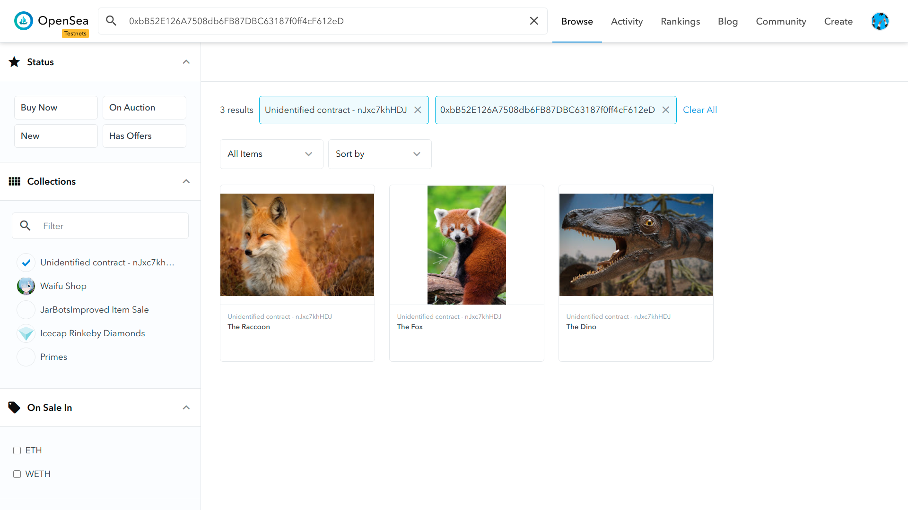

# ERC11155: Mushroom



## Resources
 - https://forum.openzeppelin.com/t/create-an-erc1155/4433
 - https://github.com/OpenZeppelin/openzeppelin-contracts/tree/master/contracts/token/ERC1155
 - https://docs.opensea.io/docs/metadata-standards
 - https://docs.openzeppelin.com/contracts/3.x/erc1155#constructing_an_erc1155_token_contract

## Helpful notes
 - `Mushroom` is a contract which hold the ERC1155 Non fungible tokens
 - `mint()` is supposed to be called from the owner and this will transfer the tokens to another smart contract
 - In comparison to `ownerOf()` in ERC721, ERC1155 has `balanceOf()`

## How to run?
 - `yarn` : installation
 - `yarn compile` : compilation
 - `yarn test` : tests
 - `yarn migrate` : migrating to rinkeby
 - `yarn verify:m` : verifying **Mushroom** on etherscan
 - `yarn verify:r` : verifying **MushroomReceiver** on etherscan

## Deployments
 - [Mushroom](https://rinkeby.etherscan.io/address/0xfA9d1298E22AFA3B5c46Db91424028857C10742A#readContract)
 - [MushroomReceiver](https://rinkeby.etherscan.io/address/0x76D82D278dc9AbA8b4Bb63Dc9b7De1Ad8C454098#contracts)
 - [Token on Opensea](https://testnets.opensea.io/assets/0xfa9d1298e22afa3b5c46db91424028857c10742a/0)

## Dependencies
```
"dependencies": {
    "@openzeppelin/contracts": "^4.0.0",
    "@truffle/hdwallet-provider": "1.0.40",
    "dotenv": "^8.2.0",
    "truffle": "^5.2.6",
    "truffle-plugin-verify": "^0.5.7"
}
```